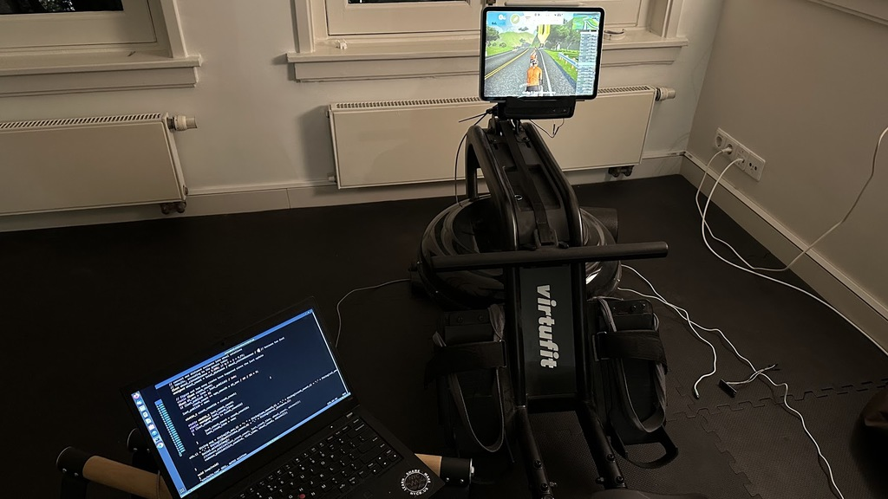

# Generic rower interface for Zwift



This turns an ESP32 into a rowing computer that will talk to Zwift
for joining friends on rides.  No laptop or companion app is necessary.

## Installation

```
platformio run -t upload -t monitor
```

## Calibration

The rower to bike calibration is really rough. Wheel counts are off
by a factor of three? Strokes/minute needs to be multiplied by 3?

TODO: Add calibration factors

## Physics

There is a very basic physics model for computing the speed of the rower.
It depends on the length and speed of the pull, which is used to estimate a force,
which to accelerate the boat against a constant drag that is slowing the boat.

TODO: Update physics model to apply an impulse each tick.

```
                vel -= vel * drift_constant * dt;

                // add any force from the oar, minus the drag of the
                const float drag = vel * vel * drag_constant;
                vel += (oar_force - drag) * dt;

                // low-pass filter the velocity for output
                vel_smooth = (vel_smooth * vel_smoothing + vel) / (vel_smoothing + 1);
                spm_smooth = (spm_smooth * spm_smoothing + spm) / (spm_smoothing + 1);

                // integrate for total distance
                total_distance += vel_smooth * dt;

```
